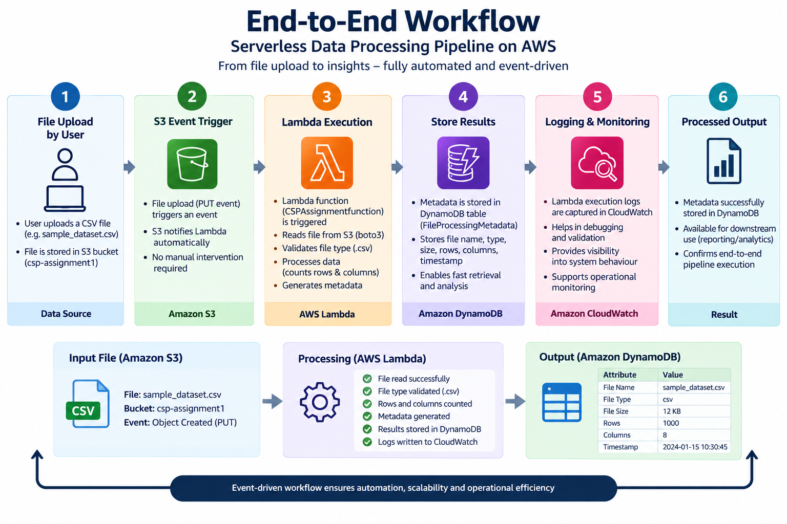
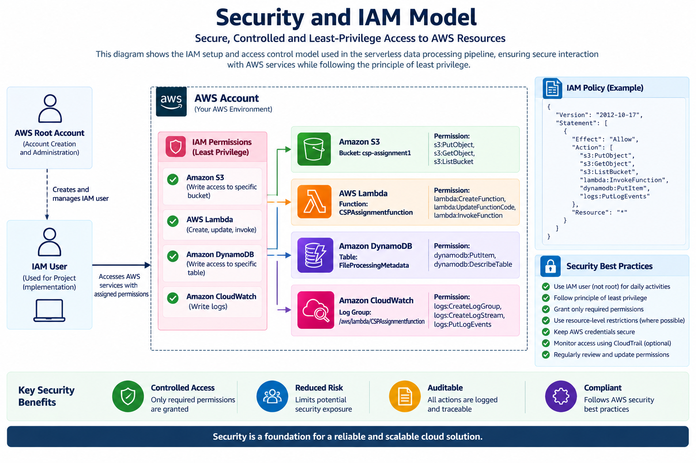

# Building a Serverless Data Processing Pipeline on AWS

**M.Sc. in Data Science and AI --- Cloud Services & Platform**

## Project Overview

This project demonstrates the design and implementation of a
**serverless, event-driven data processing pipeline on Amazon Web
Services (AWS)**. The solution uses:

-   **Amazon S3** as the data ingestion layer
-   **AWS Lambda** for automated file processing
-   **Amazon DynamoDB** for metadata storage
-   **Amazon CloudWatch** for logging and monitoring
-   **AWS IAM** for controlled access and permissions

A CSV file uploaded to the S3 bucket initiates the workflow
automatically. The Lambda function reads and validates the uploaded
file, calculates basic file metrics such as row and column counts,
generates structured metadata, records execution information, and stores
the resulting metadata in DynamoDB.

The project demonstrates practical cloud architecture principles
including **serverless computing, event-driven execution, loose
coupling, scalability, pay-per-use operation, observability, and
controlled access**.

------------------------------------------------------------------------

## Architecture at a Glance

``` text
CSV File Upload
      |
      v
 Amazon S3
      |
      | S3 PUT Event
      v
 AWS Lambda
      |
      +----> Read CSV using boto3
      +----> Validate file type
      +----> Count rows and columns
      +----> Generate metadata
      |
      +--------------------> Amazon CloudWatch
      |                       Logging & Monitoring
      |
      v
 Amazon DynamoDB
      |
      v
Processed File Metadata
```

### High-Level Architecture


------------------------------------------------------------------------

## End-to-End Workflow



The workflow consists of:

1.  A user uploads a CSV file.
2.  The file is stored in the Amazon S3 bucket.
3.  The S3 PUT event automatically invokes the Lambda function.
4.  Lambda reads and validates the CSV file and calculates basic file
    metrics.
5.  Structured metadata is generated and stored in DynamoDB.
6.  Lambda execution information is recorded in CloudWatch.
7.  The resulting database record provides evidence of successful
    downstream processing.

------------------------------------------------------------------------

## Lambda Processing Lifecycle


The Lambda processing lifecycle shows the internal execution sequence
from the S3 event through file retrieval, validation, processing,
metadata generation, DynamoDB storage, logging, and error handling.

The implementation uses the Lambda function **`CSPAssignmentfunction`**
and reads the uploaded file from S3 using **boto3**.

------------------------------------------------------------------------

## AWS Services and Responsibilities


  -----------------------------------------------------------------------
  AWS Service                         Responsibility
  ----------------------------------- -----------------------------------
  **Amazon S3**                       Stores uploaded CSV files and
                                      generates the object-created event

  **AWS Lambda**                      Performs event-driven file
                                      processing and metadata generation

  **Amazon DynamoDB**                 Stores structured file-processing
                                      metadata

  **Amazon CloudWatch**               Captures Lambda execution logs and
                                      supports monitoring/debugging

  **AWS IAM**                         Controls access to AWS resources
                                      and supports least-privilege access

------------------------------------------------------------------------

## Security and IAM



AWS Identity and Access Management (IAM) is used to control access to
the resources required by the workflow.

A dedicated IAM user was used for the assignment workflow rather than
continuing implementation with the root account. The Lambda execution
role provides the permissions required for service interaction.

The security approach follows the **principle of least privilege** and
supports controlled interaction between S3, Lambda, DynamoDB and
CloudWatch.

------------------------------------------------------------------------

## Observability and Monitoring


Amazon CloudWatch provides visibility into Lambda execution and
supports:

-   Execution logging
-   Debugging and validation
-   Monitoring of execution behaviour
-   Operational visibility
-   Identification of processing or access issues

The project includes AWS console evidence of CloudWatch logs and
successful execution activity.

------------------------------------------------------------------------

## Cost and Scalability


The architecture uses managed, serverless AWS services. Lambda execution
is event-driven, so processing occurs when required rather than relying
on a continuously running server.

The design demonstrates:

-   Event-driven execution
-   No traditional server provisioning for the processing function
-   Automatic handling of additional processing events
-   Managed storage and database services
-   Usage-based serverless operation
-   Reduced infrastructure-management overhead

The visualization provides an illustrative view of cost and scalability
characteristics. Actual AWS charges depend on workload, region, service
configuration, and usage.

------------------------------------------------------------------------

## Implementation Details

### Amazon S3

The project uses an S3 bucket named:

`csp-assignment1`

The sample input file is:

`sample_dataset.csv`

The S3 upload acts as the starting point of the automated workflow.

### AWS Lambda

Lambda function:

`CSPAssignmentfunction`

The function is connected to the S3 bucket through an **S3 PUT event
trigger**.

The processing function:

-   Reads the uploaded file from S3 using boto3
-   Validates that the uploaded file is a CSV
-   Calculates the number of rows
-   Calculates the number of columns
-   Generates structured file metadata
-   Writes the resulting metadata to DynamoDB
-   Produces execution logs for CloudWatch

### Amazon DynamoDB

DynamoDB table:

`FileProcessingMetadata`

The table stores structured metadata generated by the Lambda function,
including:

-   File name
-   File type
-   File size
-   Number of rows
-   Number of columns
-   Processing timestamp

### Amazon CloudWatch

CloudWatch captures Lambda execution logs and provides operational
visibility for debugging, monitoring, and validation.

### AWS IAM

IAM provides controlled access to the AWS resources required by the
project and supports least-privilege access.

------------------------------------------------------------------------

## End-to-End Validation

The implemented workflow was validated by uploading a new CSV file to
the S3 bucket and observing the downstream processing.

The documented validation sequence is:

1.  CSV file uploaded to Amazon S3.
2.  S3 PUT event triggered `CSPAssignmentfunction`.
3.  Lambda read and validated the CSV file.
4.  File metrics were calculated.
5.  Execution information was recorded in CloudWatch.
6.  Generated metadata was stored in the `FileProcessingMetadata`
    DynamoDB table.
7.  The resulting logs and database update provided evidence of the
    end-to-end workflow.

------------------------------------------------------------------------

## Cloud Architecture Principles Demonstrated

  -----------------------------------------------------------------------
  Principle                           Demonstration
  ----------------------------------- -----------------------------------
  **Event-driven architecture**       Processing starts when a CSV file
                                      is uploaded to S3

  **Serverless computing**            Lambda provides on-demand execution
                                      without a continuously running
                                      application server

  **Loose coupling**                  S3, Lambda, DynamoDB and CloudWatch
                                      have distinct responsibilities

  **Scalability**                     Managed serverless services can
                                      accommodate additional processing
                                      events

  **Cost efficiency**                 Processing resources are used when
                                      execution is required

  **Observability**                   CloudWatch provides logs for
                                      monitoring, debugging and
                                      validation

  **Security**                        IAM controls access and supports
                                      least-privilege principles
                                      
------------------------------------------------------------------------

## Learning Outcomes

This project provided practical experience with:

-   Integrating multiple AWS managed services into a single automated
    workflow
-   Event-driven execution using S3 and Lambda
-   IAM users, roles and controlled permissions
-   Programmatic interaction with AWS using boto3
-   CloudWatch logging and observability
-   Structured metadata storage using DynamoDB
-   Serverless architecture and reduced infrastructure-management
    overhead

------------------------------------------------------------------------

## Possible Extensions

The current implementation can be extended to:

-   Support additional input file formats
-   Add richer data-quality and validation checks
-   Integrate downstream analytics or reporting services
-   Trigger additional workflows after successful processing
-   Expand monitoring and alerting for operational failures

------------------------------------------------------------------------

## Repository Structure

``` text
.
├── README.md
├── requirements.txt
├── MSc_Cloud_Services_Serverless_Data_Processing_Pipeline_FINAL.docx
├── visualizations/
│   ├── aws_serverless_architecture.png
│   ├── end_to_end_workflow.png
│   ├── lambda_processing_lifecycle.png
│   ├── aws_service_responsibility_map.png
│   ├── security_iam_model.png
│   ├── observability_monitoring.png
│   └── cost_estimation_scalability.png
└── ...
```

------------------------------------------------------------------------

## Conclusion

This project demonstrates how a simple CSV upload can initiate a fully
automated serverless data-processing workflow using AWS managed
services.

By combining **Amazon S3, AWS Lambda, Amazon DynamoDB, Amazon CloudWatch
and AWS IAM**, the solution demonstrates event-driven processing,
automation, loose coupling, scalability, observability and controlled
access.

The project provides a practical foundation for extending the workflow
into richer data-validation, analytics, reporting and monitoring
solutions.

------------------------------------------------------------------------

## Academic Context

**Author:** Sunita Baloda\
**Programme:** M.Sc. in Data Science and AI\
**Course:** Cloud Services & Platform\
**Institution:** BITS Pilani Digital\
**Project:** Building a Serverless Data Processing Pipeline on AWS
